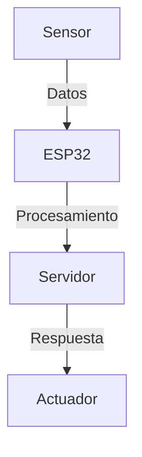

# Welcome to MkDocs

For full documentation visit [mkdocs.org](https://www.mkdocs.org).

## Commands

* `mkdocs new [dir-name]` - Create a new project.
* `mkdocs serve` - Start the live-reloading docs server.
* `mkdocs build` - Build the documentation site.
* `mkdocs -h` - Print help message and exit.

## Project layout

    mkdocs.yml    # The configuration file.
    docs/
        index.md  # The documentation homepage.
        ...       # Other markdown pages, images and other files.

<div style="display: flex; justify-content: center;">

</div>

✅ **Soporte para diagramas sin imágenes**.  
✅ **Permite visualizar procesos fácilmente**.

---

## **3️⃣ Añadir Animaciones y Transiciones**
📌 **Agregamos animaciones suaves en `extra.css`:**

```css
/* Fade-in para el contenido */
.md-content {
  animation: fadeIn 0.5s ease-in-out;
}

@keyframes fadeIn {
  from { opacity: 0; }
  to { opacity: 1; }
}

/* Hover con transición suave */
a:hover {
  transition: color 0.3s ease-in-out;
}

/* Centrar los diagramas Mermaid */
.mermaid {
  display: flex;
  justify-content: center;
}
```

---

## **Botones interactivos**
📌 **Botón para volver arriba y activar el modo lector:**

<button id="btn-top">
  <i class="material-icons">arrow_upward</i>
</button>

<button id="reader-mode">📖 Modo Lector</button>

<script>
  document.getElementById('btn-top').addEventListener('click', function() {
    window.scrollTo({ top: 0, behavior: 'smooth' });
  });

  document.getElementById('reader-mode').addEventListener('click', function() {
    document.body.classList.toggle('reader-mode');
  });
</script>
